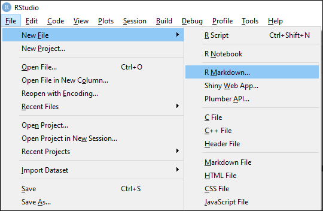

---
output:
    html_document:
        code_folding: hide 
---
 

#### R Markdown

R makes it real easy to create Markdown files. It is as simple as navigating
the RStudio menu system.  

 

This creates a template with some instructions and links from which the user
can modify the document.  
 

#### Examples

* Result: [R Markdown site](https://rmarkdown.rstudio.com/index.html)  
From: `[R Markdown site](https://rmarkdown.rstudio.com/index.html)`

* Result: $x^2 + \frac{1}{4}x = 8$  
From: `$x^2 + \frac{1}{4}x = 8$`

* Result:   
From: ``

* Result: `r x = 14 ; 5 / x`  
From: ` r x = 14 ; 5/ x `

  

### GitHub
Related file(s) can be found at <a href="https://github.com/eltownes/USF-LIS4370/tree/master/Module%2012">Git Me</a>
  

