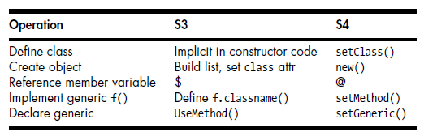

---
output:
    html_document:
        code_folding: hide 
---
<br>


#### Using Orange dataset from package ‘datasets’

Let's load the dataset.

```{r }
data("Orange")
```
<br>

#### Generic functions

Generic functions are functions that work with polymorphism which means
that the same function call leads
to different operations for objects of different classes.
  
When a generic function is called, R will dispatch the call to the proper
class method, meaning that it will reroute the
call to a function defined for the object’s class.

Let's consider two EDA functions on the Orange dataset: summary and plot.

```{r }
summary(Orange)
plot(Orange)
```
<br>

The functions `summary` and `plot` are generic S3 functions.  

* a call to `?summary` and `?plot` will have the R Documentation tell us: `...generic function...` 
* a call to `summary` and `plot` will show the function `UseMethod` which
is used to declare a generic S3 method
* a call to `isS4(summary)` and `isS4(plot)` will return `FALSE`

```{r }
summary
isS4(plot)
```
<br>


#### S3 vs S4

S3, is still the dominant OOP class paradigm in R use today. S4 classes were developed later, with goal of adding safety, meaning that you cannot 
accidentally access a class component that is not already in existence.  
  
The best summary is probably: **convenience of S3 vs the safety of S4.**  
  
A quick S3 vs S4 comparison table.



<br>


#### Sample S3 and S4

Let's model a car for efficiency (mpg), engine size (cyl), and 
transmission (gear).  
  
A S3 object (Mazda RX4) is instantiated via a list.

```{r }
s3 <- list(name = "Mazda RX4", mpg = 21, cyl = 6, gear = 4)
class(s3)
s3
```
<br>

A S4 object (Mazda RX4) first requires a class definition and is then instantiated via the new() method

```{r }
setClass(
    "car",representation(
        mpg = "numeric", cyl = "numeric", gear = "numeric"
    )
)
s4 <- new("car", mpg = 21, cyl = 6, gear = 4)
class(s4)
s4
```
<br>


<br><br>

### GitHub
Related file(s) can be found at <a href="https://github.com/eltownes/USF-LIS4370/tree/master/Module%207">Git Me</a>
<br><br>

