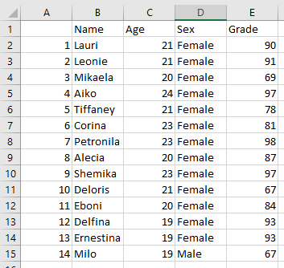

---
output:
    html_document:
        code_folding: hide 
---
<br>


### Set environment
```{r message=0, results='hide'}
env <- c("plyr","dplyr","stringr")
lapply(env, library, character.only = 1)
```
<br>

### Read a file containing students' names, age, sex, and grade.
<br>

##### * The file name "Assignment 6 Dataset-1.txt" is hardcoded - `str` and `head` follows.

```{r }
autoData <- read.table("Assignment 6 Dataset-1.txt", header = TRUE, sep = ",")
str(autoData)
head(autoData)
```
<br>

##### * File name is user provided.

In this case `readLine` is used. This does require an interactive session. 
From the R documentation:    

"An interactive R session is one in which it is 
assumed that there is a human operator to interact with"

So the code will not run & show on a "Knit to HTML" document. Knitting 
throws an error unless the code first checks for session type.
In this case we check for interactivity by using: `if ( interactive() )`

```{r }
if ( interactive() ){
  fileInput <- readline("Enter filename to read: ")
  manualData <- read.table(fileInput, header = TRUE)
  head(manualData)
} else {
  cat( "This code block must be run in an interactive session."  )
}
```
<br>

### Get the grouped mean using package `plyr`

```{r }
groupedAverage = ddply(autoData, "Sex", summarise,
                       Average = mean(Grade)
                       )
groupedAverage
```
<br>

So, how many males and females?

```{r }
autoData %>% group_by(Sex) %>%
  summarise(Count = n())
```
<br>

### Filtering

Filter the dataframe for names that contain the letter "i". Then 
create a new data set with those names. 

Let's use package `stringr` to make things easy and clear.

```{r }
df <- autoData %>%
  filter( str_detect(Name, "i")  )
str(df)
head(df)
```
<br>


### Write to a file.

Write the new dataframe to a CSV file using `write.csv`.

```{r }
write.csv(df,  "i-students.csv")

```
<br>

Opening the CSV file in Excel shows us:  


<br><br>


### GitHub
Related file(s) can be found at <a href="https://github.com/eltownes/USF-LIS4370/tree/master/Module%208">Git Me</a>
<br><br>

